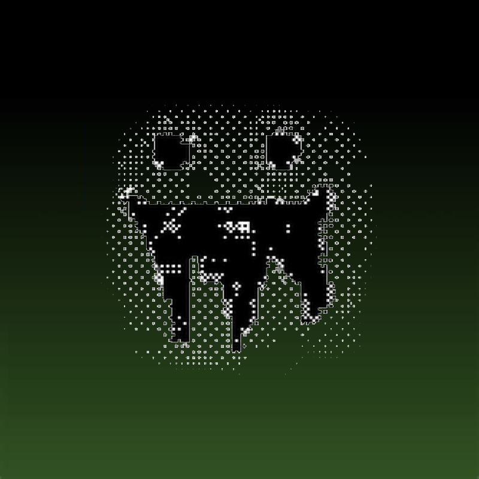
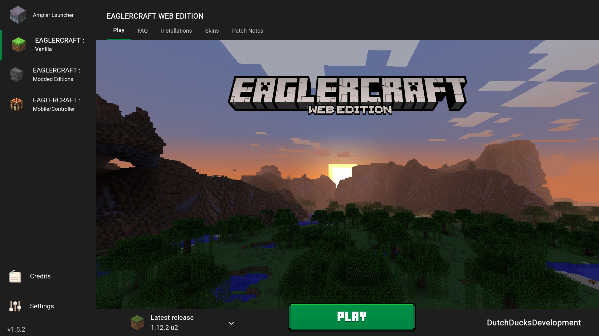

#  
 A minecraft themed launcher for Eaglercraft! 
 Containing some of the best clients all in one place!

 

 ## Versions
 __v1.5.3__ - Moved the entire repo to EaglerLauncher.github.io, Added a server screen and made the skin editor into its own tab 
 __v1.5.2__ - Added way more clients and some new modpacks to the launcher and updated some clients 
 __v1.5.1__ - Added customizable launcher options, credits, settings, more memory options, and updated code! (made by irv77) 
 __v1.5.0__ - Made the executable apps offline 
 __v1.4.3__ - Added executable apps for Linux, MacOS and Windows 
 __v1.4.2__ - Added TheCreationKing's Skin editor, Added Kone client and optimized code 
 __v1.4.1__ - Creation of Eagler launcher, removed a not working version of eaglercraft, renamed some things and added credits 
 __v1.4.0__ - Added News, bug fixes, and integrated mods! 
 __v1.3.1__ - Organized and updated code, added memory options, more games, installations, usernames, and faq screen! 
 __v1.2.0__ - Updated games. 
 __v1.1.0__ - Updated code and optimized! 
 __v1.0.0__ - Main code with future updates planned!

 

## Installation
 The easiest way is to just play in your browser 
 But you can download the offline app [here](https://github.com/DutchDucksDevelopment/EaglerLauncher/releases)

## Features Planned

Click here to expand feature list

- [x] Add the servers screen
- [x] Add Credits screen
- [x] Add Settings screen
- [x] Rewrite some of the css and js
- [x] Organize code, and add comments
- [x] Add a customizable launcher selector
- [x] Save last played game
- [x] Add FAQ screen
- [x] Add Installations screen
- [x] Add Mods screen
- [x] Add Skins screen
- [x] Add Patch Notes screen
- [ ] Fix display errors
- [x] Offline launcher download?

## Credits
irv77:
- made the gui for Ampler Launcher, which Eagler Launcher is a fork of
- made the eaglercraft itself work in Ampler Launcher

Dutch Ducks Development:
- forked Ampler Launcher into Eagler Launcher
- removed unstable/not working features
- added an offline app
- added many new clients and modpacks into the launcher
- added a server screen

TheCreationKing:
- made the skin editor

